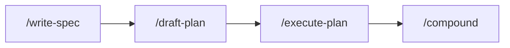

# Harness Engineering Template

[](https://www.claude-hunt.com)
[](https://docs.claude-hunt.com)

> [Claude Hunt](https://www.claude-hunt.com) 강의용 Next.js 16 + React 19 템플릿.
> 사용법과 워크플로우 문서는 [docs.claude-hunt.com](https://docs.claude-hunt.com)에서 확인하세요.

## 기술 스택

- **Framework**: Next.js 16 (App Router)
- **UI**: React 19, Tailwind CSS 4, shadcn/ui, Radix UI, Base UI
- **Icons**: Lucide React
- **Testing**: Vitest, Testing Library, Playwright
- **Lint**: ESLint
- **Package Manager**: Bun

## 시작하기

```bash
bun install
bun dev
```

[http://localhost:3000](http://localhost:3000)에서 결과를 확인할 수 있습니다.

E2E 테스트를 처음 실행하기 전에 Chromium을 설치합니다:

```bash
bunx playwright install chromium
```

## 스크립트

| 명령어 | 설명 |
|---|---|
| `bun dev` | 개발 서버 실행 |
| `bun run build` | 프로덕션 빌드 |
| `bun start` | 프로덕션 서버 실행 |
| `bun run lint` | ESLint 실행 |
| `bun run test` | Vitest 실행 |
| `bun run test:watch` | Vitest 워치 모드 |
| `bun run test:e2e` | Playwright E2E 실행 |
| `scripts/spec-coverage.sh <feature> [--tests]` | spec 판정 기준의 plan 배정·테스트 인용 검사 |

## Hooks

Claude Code hooks 기반 자동 품질 게이트 (`.claude/settings.json`)

| 단계 | 트리거 | 동작 |
|---|---|---|
| **WorktreeCreate** | 워크트리 생성 | `worktree-create.sh`: main 동기화, `.env` 복사, 의존성 설치 |
| **PostToolUse** | `Write\|Edit` | `lint-fix.sh`: ESLint auto-fix |

## 테스트 파일 컨벤션

| 파일 패턴 | 용도 |
|---|---|
| `*.test.tsx` / `*.test.ts` | 단위·통합·판정 기준 테스트 (Vitest, colocated) |
| `*.spec.ts` | E2E 테스트 (Playwright, `e2e/`) |

테스트 이름에는 담당하는 spec 판정 기준 ID를 `[S1-1]` 형식으로 인용합니다. 자세한 테스팅 원칙은 [CLAUDE.md → Testing](./CLAUDE.md#testing)을 참조합니다.

## Claude Code 워크플로우

### 코어 경로



모든 feature가 통과하는 경로입니다. 한 세션에 끝나고 diff를 한 문장으로 설명할 수 있는 작업은 코어 경로 대신 Claude Code 내장 plan 모드로 진행합니다.

#### 1. Specify (`/write-spec`)

사용자와 대화하며 feature의 스펙을 작성합니다. 사용자 흐름을 시뮬레이션하고 빈칸을 질문으로 채운 뒤, 시나리오와 판정 기준을 담은 `artifacts/<feature>/spec.md`를 생성합니다. WHAT만 기술하며 구현 결정(파일 경로, 라이브러리 등)은 포함하지 않습니다.

spec.md가 각 feature의 **단일 원본**입니다. 각 판정 기준은 ID(`S1`, `S1-1`, `INV-1`)를 가지며, plan과 테스트는 이 ID를 참조합니다. 문서는 feature 완료를 실행으로 증명하는 End-to-end 검증 절차로 끝납니다.

#### 2. Plan (`/draft-plan`)

spec.md를 참조해 구현 계획을 수립합니다. vertical slicing과 의존성 순서로 TDD 기반 Task 목록을 만들고, 각 Task는 담당하는 판정 기준을 ID로 참조합니다. 커버리지(모든 ID가 어느 Task에 배정됐는가)는 `scripts/spec-coverage.sh`가 기계적으로 검사합니다. 산출물은 `artifacts/<feature>/plan.md`입니다.

#### 3. Build (`/execute-plan`)

plan.md의 Task를 한 번에 하나씩 구현합니다. TDD(RED → GREEN) 규율을 따르고, 테스트 이름에 판정 기준 ID를 인용하며, Task당 conventional commit 하나를 만듭니다. 완료의 기준은 실행 증거입니다: spec의 체크박스는 테스트 통과 또는 End-to-end 확인으로만 켜지고, 마지막에는 spec의 End-to-end 검증 절차를 실제로 실행합니다. 독립 검증은 내장 `/code-review` 스킬이 담당하고, 구현 중 판단·함정·우회는 `artifacts/<feature>/learnings.md`에 검색 키워드(`triggers`)를 달아 기록합니다 — 다음 feature의 `/draft-plan`·`/execute-plan`이 grep으로 검색해 재사용하는 메모리입니다.

#### 4. Compound (`/compound`)

여러 feature에 쌓인 `learnings.md`를 정리하는 정원사 역할입니다: 중복 항목 병합, 모순되는 지시문 해소, 낡은 항목 폐기, 재발이 확인된 `hypothesis`의 `verified` 확정. 규칙을 만들지 않습니다 — 메모리의 품질을 관리합니다. 사용자 승인 후에만 적용합니다.

### 옵션 모듈

조건이 맞을 때만 켜는 단계입니다.

| 모듈 | 켜는 조건 | 산출물 |
|---|---|---|
| `/idea-refine` | 아이디어가 막연하거나 여러 방향 중 하나를 정해야 할 때 | `artifacts/<feature>/idea.md` |
| `/sketch-wireframe` | 레이아웃 구조가 바뀌는 UI feature. spec 확정 후, plan 전에 실행 | `artifacts/<feature>/wireframe.html` |
| `plan-reviewer` 에이전트 | Task 5개 이상, wireframe 존재, 또는 되돌리기 비싼 도메인 | plan 독립 검토 리포트 |

### 검증 책임

| 실패 양상 | 담당 | 방식 |
|---|---|---|
| 누락 (합의된 기준이 테스트 없이 증발) | `scripts/spec-coverage.sh` | 기계적 grep |
| 왜곡 (테스트가 ID를 달고 엉뚱한 것을 단언) | `/execute-plan` Step 4 | 인용된 ID의 spec 원문과 단언 대조 |
| 품질 (버그, 중복, 비효율) | 내장 `/code-review` | feature 브랜치 전체 diff 리뷰 |
| 초록불 착각 (커버는 됐지만 실제로 안 됨) | spec의 End-to-end 검증 절차 | 실행 증거로만 완료 판정 |

각 단계는 human review gate를 가집니다. 현재 단계가 검증되기 전에는 다음 단계로 넘어가지 않습니다.
